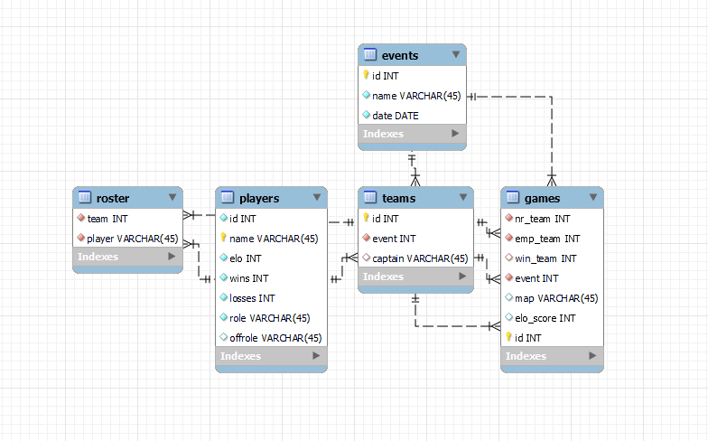

Squadrons PreBeer League API
============================
A simple API that connects to a database to store a player's Elo score, as well as match, event and Elo history.

The underlying database structure is as follows

## Routes
There are 3 main routes that connect to 5 different services, one service for each table.

### Players
Data relating to a players, and their team/match history
##### GET /players
Return all players in alphabetical order
##### GET /players/top
Return all players in Elo ranking, descending 
##### GET /players/{name}
Return basic player data - Name, Elo, Wins, Losses, Role and Offrole
##### GET /players/{name}/teams
Return the team ID of all teams a player played on
##### GET /players/{name}/games
Return game data for all games a player played in - NR Team ID, Empire Team ID, Winning Team, Event ID, Map, Elo delta, and game ID
##### POST /players
Add a new player - requires a JSON body with at least name and role

Example:
	
	{
		"name": "Esoda",
		"role": "Support"
	}
##### POST /players/{name}/{teamId}
Add a player to a team
##### PUT /players/{name}
Update a players record - requires JSON body with wins, losses and elo

Example:

	{
		"elo": 1600,
		"wins": 5,
		"losses": 1
	}

### Events
Data relating to events, such as their associated teams and games
##### GET /events
Return all events - ID, date and name
##### Get /events/{eventId}
Return information for a single event - ID, date and name
##### GET /events/{eventId}/teams
Return all teams associated with event
##### GET /evevnts/{eventId}/games
Return all games associated with event
##### POST /events
Add a new event - requires a JSON body with name

Example:

	{
		"name": "Kickoff Event"
	}
##### POST /events/{eventId}/games
Add a new game to the event - requires a JSON body with NR Team ID and Empire Team ID

Example:

	{
		"nr_team": 3,
		"emp_team": 7
	}
##### PUT /events/games/{gameId}
Update a game with its final result - requires a JSON body with Winning Team ID, Elo delta and Map

Example:

	{
		"win_team": 7,
		"elo_score": 13,
		"map": "Esseles"
	}

### Teams
Data relating to teams, such as their associated players and games
##### GET /teams/{teamId}
Return information about a single team - Captain, ID and Event ID
##### GET /teams/{teamId}/players
Return a list of player names belonging to a team
##### GET /teams/{teamId}/games
Return a list of all games a team has played
##### GET /teams/{teamId}/nr
Return a list of all nr games a team has played
##### GET /teams/{teamId}/empire
Return a list of all empire games a team has played
##### POST /teams
Create a new team - requires a JSON body with captain name and event ID

Example:

	{
		"captain": "Esoda",
		"event": 2
	}